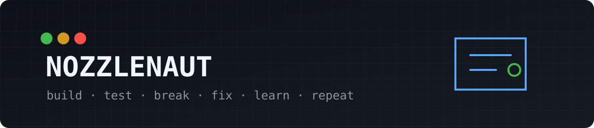

  

  
  
  

## Hey, I'm Nozzlenaut

I build hardware and software projects because I want to know if an idea actually works for a normal person — not just in a polished demo.

Most of these start with some version of:

> **Can I make this cheaper, simpler, or more useful with stuff I already have?**

3D printing, handhelds, repair experiments, small websites, homelab stuff, and whatever other rabbit hole looks interesting that week.

## On the bench

| Project | Status | What I'm trying to do |
| --- | --- | --- |
| **[AndroidKlipper](https://github.com/nozzlenaut/androidklipper)** | 🟢 Working / testing | Run Klipper from Android hardware instead of automatically buying another Raspberry Pi. [Video](https://www.youtube.com/watch?v=Nz-z8JivqjY) |
| **[HandheldHero](https://github.com/nozzlenaut/HandheldHero)** | 🟡 Building | Make fresh handheld setup less annoying: device-aware packages, Wi-Fi, emulators, tools and hotkeys. |
| **[TrimUI Brick Clock+](https://github.com/nozzlenaut/Trimui-Brick-Clock-Plus)** | 🟢 Working | Better clock mode with burn-in protection plus useful sync / connection status. |
| **Item → Gridfinity** | 🟡 Testing | Turn real-world dimensions into a Gridfinity tray/holder, eventually with saved designs and cheap STL/STEP export. |
| **Controller tester / repair reports** | 🟡 Testing | Identify controllers, test buttons/sticks/USB and make a clean report for resale listings. |

## Sites I run

### 🔎 [PriceSift](https://pricesift.app)
Used/budget gear search and comparison. Cameras, GPUs, consoles, books, price history, and experiments around making used shopping less annoying.

### 🧩 MatchMyModel
A low-maintenance compatibility/search project for figuring out whether a part or accessory actually fits a specific model.

## Other things I'm poking at

- 🔧 Small electronics flips and repair lots
- 📦 Public-sector supply bids
- 🖨️ 3D-printing tools and mods
- 🎮 Handhelds and controller repair/testing
- 🧪 Cheap hardware doing jobs normally handed to more expensive hardware
- 💡 Tiny tools that might someday make a couple bucks instead of becoming another abandoned folder

## How I look at projects

I'm not approaching this as a professional reviewer or production shop. I document things from an **average-person point of view**:

**What did it cost?** · **What was annoying?** · **What broke?** · **What actually worked?** · **Would I do it again?**

Some projects work. Some are dumb. Some turn into useful tools. That's kind of the point.

---

Currently accepting bad ideas with suspiciously good upside.

